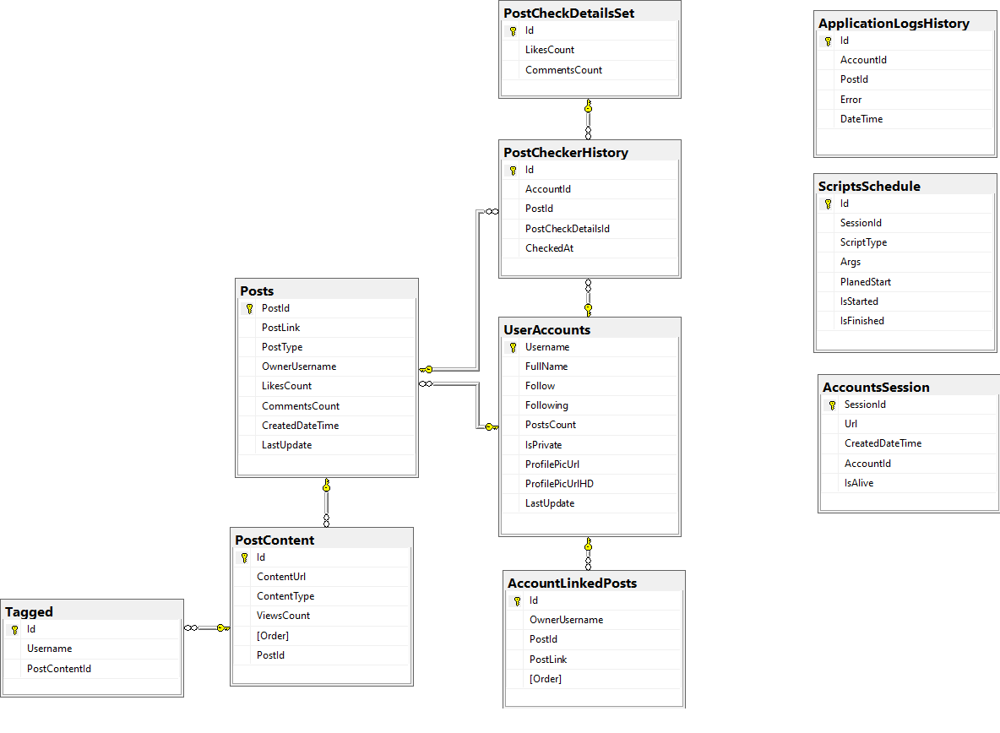

# Getting Started

## Database

**Type of database**: MS SQL

**ORM**: Entity Framework Core

Database was designed by method of code-first (database generating from code models).

To generate database from code you should use **Visual Studio**. Follow next steps:
1.  Open project in Visual Studio;
2.  Go to **Package Manager Console**;
3.  Setup **Default Project** to **WeddingForward.Data**
4.  Run command:
```
Update-Database
```

### Structure


Notes:
- **PostContent** - table that contains information about one post`s slide:
  - Column (ContentType) 
    1.  Photo - **GraphImage**
    2.  Video - **GraphVideo**
    3.  Aggregated type for multiple slides post item - Carousel **(GraphSidecar)**
- **AccountLinkedPosts** - define the relation between account and post.
- **PostCheckerHistory** - high-level definition of scan with the information about account, post, date & time of check and id which represents details of scan.
- **PostCheckDetailsSet** - represents details about post scan. For the future you can add more values here to compare the results.
- **ScriptsSchedule** - definition of schedules which are have to be running automatically. 
  - SessionId - name of the user on which application will open the session. If there is no one, the application will create new one and save it on the machine.
  - ScriptType - now suppords only 2 types of scripts:
    - **PostChecker** - add snapshot of trackable information about the certain post. 
    - **AccountsMonitoring** - scan for new posts on accounts which have already added to schedule.

##  Server

Written on ***ASP.NET Core 3.1***, works under IIS on Windows Server.

Solution contains 5 projects:
- **WeddingForward.Api** - startup project of the solution, runs the web api.
- **WeddingForward.ApplicationServices** - application services, contains business logic, integration between database and pything scripts, authorization and etc.
- **WeddingForward.Data** - specified ORM database models, migrations.
- **WeddingForward.Scheduler.Console** - console for working with API of web service like: added scripts to schedule, running scripts manually, retrieving results from db and etc. Added only for troubleshooting on running some logic manually.
- **WeddingForward.ScheduleTaskExecutor** - scripts` schedule logic implementation.
